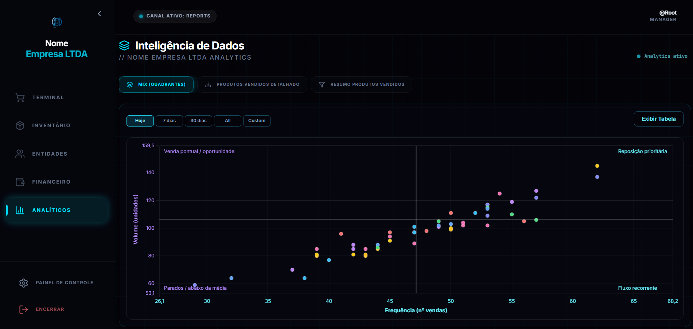
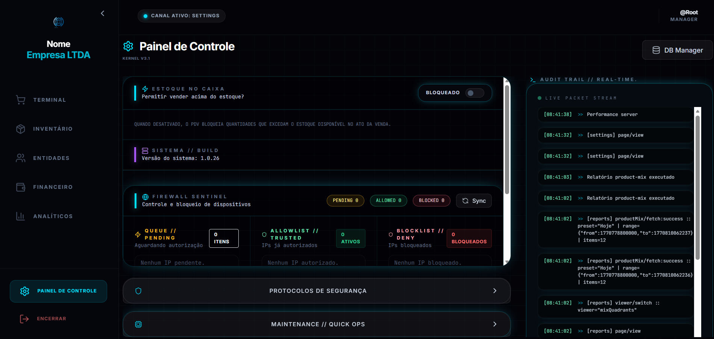
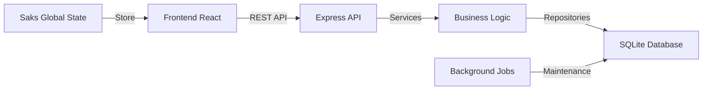

# 🛒 PDVsystem

<div align="center">


**Sistema de Vendas e gestão de estoque**

[Documentação Completa](docs/README.md) • [Instalação](#-instalação-rápida) • [Recursos](#-recursos-principais) • [Arquitetura](#-arquitetura)

</div>

---

## 📋 Sobre o Projeto

**PDVsystem** é um sistema de ponto de venda e gestao de estoque de alta performance. Combina uma interface React intuitiva com um backend Node.js robusto, oferecendo gestão completa de vendas, estoque, caixa, clientes e relatórios analíticos em tempo real.

Projetado para atender desde pequenos e médios comércios, focando em velocidade, estabilidade e experiência do usuário.

---

## 📸 Tour Visual do Sistema

Explore as principais funcionalidades do sistema através das imagens abaixo. Clique nas seções para expandir.

<details>
<summary><b>🖥️ Terminal de Vendas (PDV)</b></summary>
<br>

> **Foco em Produtividade**: Interface otimizada para operação via teclado, garantindo vendas rápidas e sem uso do mouse. Registro de múltiplos pagamentos, descontos e impressão direta.


*(Exemplo da interface de vendas)*
</details>

<details>
<summary><b>📦 Gestão de Estoque e Produtos</b></summary>
<br>

> **Controle Total**: Cadastro detalhado de produtos, controle de estoque mínimo, categorias e fornecedores. Importação e exportação em massa (Excel) para facilitar a migração.


</details>

<details>
<summary><b>💵 Fluxo de Caixa e Financeiro</b></summary>
<br>

> **Auditoria e Segurança**: Abertura e fechamento de caixa com conferência cega. Histórico completo de sangrias, suprimentos e quebra de caixa.


</details>

<details>
<summary><b>📊 Dashboards e Relatórios (BI)</b></summary>
<br>

> **Inteligência de Negócio**: Gráficos interativos de vendas de produtos por volume e frequência e produtos mais vendidos.


</details>

<details>
<summary><b>🔒 Configurações e Monitoramento</b></summary>
<br>

> **Controle Técnico**: Monitoramento de recursos do servidor (CPU/RAM) em tempo real, logs de auditoria, whitelist de IPs e gerenciamento de permissões de usuários.


</details>

---

## 🚀 Recursos Principais

### 💰 Para o Operador (Frente de Caixa)
- **Venda Rápida**: Agilidade na finalização da venda (Enter contínuo) e auto-focus no campo de busca
- **Flexibilidade**: Pagamentos mistos (ex: R$50 Dinheiro + R$100 Cartão)
- **Offline-First**: Operação contínua mesmo com oscilações de rede (Sync automático)

### 🏢 Para o Gerente (Backoffice)
- **Relatórios**: Curva ABC de produtos, fechamento diário/mensal automatico
- **Fiscal**: Emissão de comprovantes não fiscais e preparação para NFC-e (em desenvolvimento)
- **Segurança**: Níveis de acesso granulares (Admin, Gerente, Caixa)

### 🛠️ Para o Time de TI (Suporte)
- **Update Automático**: Script de update integrado para clientes
- **Telemetria**: Logs remotos para diagnóstico de problemas
- **Acesso Remoto**: Túnel Ngrok integrado para suporte à distância

---

## 🏗️ Arquitetura e Tecnologias

O sistema segue uma arquitetura **Clean Architecture** adaptada, visando manutenibilidade e escalabilidade.

### Stack Tecnológico
- **Frontend**: React 19, TypeScript, Tailwind CSS, Shadcn/UI
- **Backend**: Node.js, Express, Better-SQLite3 (WAL Mode)
- **Infra**: PM2 para gerenciamento de processos, Scripts .bat para automação Windows

### Fluxo de Dados


---

## 💻 Guia do Desenvolvedor

Esta seção é para desenvolvedores que desejam manter ou expandir o sistema.

### Estrutura de Pastas Essencial
```
PDVsystem/
├── pages/              # Views principais (Rotas do React)
├── components/         # UI Kit e componentes reutilizáveis
├── server/src/         # Código fonte do Backend
│   ├── routes/         # Definição dos endpoints da API
│   ├── services/       # Regras de negócio complexas
│   └── db/             # Migrations e conexão SQLite
├── docs/               # Documentação técnica detalhada
└── scripts/            # Automação (.bat e .sh)
```

### Scripts de Automação (Windows)
O projeto inclui scripts `.bat` na raiz para facilitar o deploy em clientes Windows:

- `iniciar-sistema.bat`: Inicializa o PM2 e o servidor.
- `atualizar-app.bat`: Busca atualizações e aplica patches.
- `iniciar-tunel.bat`: Abre conexão remota via Ngrok para suporte.

### Primeiros Passos (Dev)

1. **Instalar Dependências**:
   ```bash
   npm install
   ```
2. **Setup do Banco**:
   ```bash
   npm run migrate
   ```
3. **Rodar em Dev**:
   ```bash
   npm run dev
   ```

> Para mais detalhes técnicos, consulte a [Pasta de Documentação](docs/).

---

## 🛡️ Segurança

- **IP Whitelist**: O sistema só aceita conexões de IPs previamente autorizados.
- **IP Whitelist**: O sistema só aceita conexões de IPs previamente autorizados.
- **Validação de Dados**: Verificação rigorosa de inputs no backend.

---

## 📥 Instalação Produção

Consulte o guia detalhado em [docs/09-instalacao-e-execucao.md](docs/09-instalacao-e-execucao.md).

```bash
# Exemplo rápido com PM2
npm run build
pm2 start server/dist/index.js --name PDVsystem
```

---

<div align="center">

**⭐ Se este projeto foi útil, considere dar uma estrela!**

</div>
