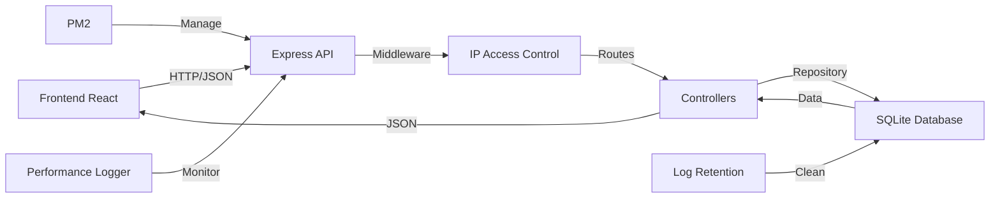

# 🛒 PDVsystem

<div align="center">


**Sistema completo de Ponto de Venda (POS) e gestão para distribuidores de bebidas**

[Documentação Completa](docs/README.md) • [Instalação](#-instalação-rápida) • [Recursos](#-recursos-principais) • [Arquitetura](#-arquitetura)

</div>

---

## 📋 Sobre o Projeto

**PDVsystem** é um sistema de ponto de venda e gestao de estoque. Combina uma interface React intuitiva com um backend Node.js robusto, oferecendo gestão completa de vendas, estoque, caixa, clientes e relatórios analíticos.

### 🎯 Este projeto demonstra:


- ✅ **Arquitetura Full-Stack moderna** - React 19 + Node.js + TypeScript
- ✅ **API RESTful completa** - Express com 15+ rotas organizadas
- ✅ **Banco de dados relacional** - SQLite com 23 migrations versionadas
- ✅ **Sistema de autenticação** - Controle de usuários e permissões (admin/manager/operator)
- ✅ **Segurança robusta** - Whitelist de IPs, guards de acesso, validações
- ✅ **Monitoramento em tempo real** - Métricas de CPU, memória, performance
- ✅ **Sistema de atualizações** - Update automático para clientes
- ✅ **Telemetria e Analytics** - Tracking de eventos e comportamento do usuário
- ✅ **Automação Windows** - Scripts .bat + PM2 para deploy em produção
- ✅ **Código limpo e organizado** - Padrões de repositório, services, middlewares

---

## 🚀 Recursos Principais

### 💰 Ponto de Venda (PDV)
- Terminal de vendas com interface keyboard-first
- Suporte a múltiplos métodos de pagamento (dinheiro, PIX, cartão)
- Multipagamento (dividir venda em vários métodos)
- Aplicação de descontos automáticos e manuais
- Geração de recibos em PDF
- Vinculação de clientes às vendas

### 💵 Gestão de Caixa
- Abertura e fechamento de sessões de caixa
- Movimentações: suprimento, sangria, pagamentos
- Auditoria completa com histórico de sessões
- Cálculo automático de diferenças (esperado vs. físico)
- Gráficos de performance e tendências

### 📦 Produtos e Estoque
- Cadastro de produtos e serviços
- Categorização e fornecedores
- Controle de estoque com alertas de mínimo
- Upload de imagens de produtos
- Importação/exportação em massa (XLSX)
- Suporte a diferentes unidades (caixa, unidade, kg, serviço)

### 👥 Gestão de Entidades
- **Usuários**: 3 níveis de permissão (admin, gerente, operador)
- **Clientes**: Cadastro completo com histórico
- **Fornecedores**: Gestão de CNPJ, contatos, categorias

### 📊 Relatórios e BI
- Produtos mais vendidos (detalhado e agregado)
- Product Mix (análise de frequência e valor)
- Breakdown de vendas por método de pagamento
- Gráficos interativos (Recharts + Chart.js)
- Exportação de dados

### 🔒 Segurança e Administração
- Whitelist de IPs com aprovação manual
- Admin DB Manager (CRUD genérico protegido)
- Logs de auditoria e telemetria
- Sistema de manutenção (purge cache, wipe local)
- Controle granular de permissões

### 🤖 Funcionalidades Especiais
- **Sistema de Atualizações** - Update automático de versões
- **Monitoramento de Performance** - CPU, RAM, Event Loop
- **Acesso Remoto** - Túnel Ngrok integrado
- **Retenção de Logs** - Limpeza automática agendada

---

## 🏗️ Arquitetura

### Stack Tecnológico

**Frontend**
- React 19 com TypeScript
- Vite (build tool)
- Tailwind CSS
- Recharts & Chart.js (gráficos)
- Lucide React (ícones)
- React Hot Toast (notificações)

**Backend**
- Node.js (v20.6.0+, recomendado v24)
- Express.js
- TypeScript
- Better-SQLite3 (banco de dados)
- Multer (upload de arquivos)
- PM2 (gerenciamento de processos)

**Infraestrutura**
- SQLite com WAL mode
- Porta padrão: 8787
- SPA servida pelo backend
- Scripts .bat para automação Windows

### Estrutura de Diretórios

```
PDVsystem/
├── pages/              # Páginas React (POS, Caixa, Produtos, etc.)
├── components/         # Componentes reutilizáveis e modais
├── services/           # Camada de serviços frontend
├── hooks/              # Hooks customizados React
├── server/
│   ├── src/
│   │   ├── routes/     # Rotas da API Express
│   │   ├── repositories/ # Camada de acesso ao banco
│   │   ├── services/   # Lógica de negócio backend
│   │   ├── middleware/ # Middlewares (IP control, etc.)
│   │   └── db/         # Database e migrations
│   └── dist/           # Build do backend
├── dist/               # Build do frontend
├── data/               # Banco de dados SQLite
├── public/uploads/     # Arquivos enviados
├── docs/               # Documentação técnica completa
└── scripts/            # Scripts de build e validação
```

### Fluxo de Dados



---

## 📥 Instalação Rápida

### Pré-requisitos
- Node.js v20.6.0 ou superior (recomendado v24)
- npm ou yarn
- Windows (para scripts .bat e PM2)

### Desenvolvimento

```bash
# 1. Clone o repositório
git clone <repository-url>
cd PDVsystem

# 2. Instale as dependências
npm install

# 3. Configure o ambiente
cp .env.example .env
# Edite .env com suas configurações

# 4. Execute as migrations do banco
npm run migrate

# 5. Inicie em modo desenvolvimento
npm run dev
```

Acesse: `http://localhost:3000` (frontend) e `http://localhost:8787` (API)

### Produção (Build Local)

```bash
# 1. Build completo
npm run build

# 2. Inicie com PM2
pm2 start server/dist/index.js --name PDVsystem --env production --node-args="--env-file=.env"
pm2 save
pm2 startup
```

### Distribuição para Cliente

```bash
# 1. Gere o pacote de release
.\package-app.bat

# 2. Distribua o arquivo gerado
# build/PDVsystem-release.zip

# 3. No cliente, extraia e execute
.\instalar-app.bat
```

---

## ⚙️ Configuração

### Variáveis de Ambiente (.env)

```env
# Servidor
PORT=8787
DB_PATH=data/novabev.sqlite

# Segurança (NUNCA habilite em produção pública!)
ENABLE_DB_ADMIN=false

# Branding
VITE_APP_NAME="NovaBev POS"

# Monitoramento
PERF_LOG_ENABLED=true
PERF_LOG_INTERVAL_MS=60000

# Webhooks (opcional)
VITE_LOGS_WEBHOOK_URL=https://...
```

### Primeiro Acesso

**Usuário padrão:**
- Email: `root@root.com`
- Senha: `root`

⚠️ **Importante**: Altere a senha do admin imediatamente após o primeiro login!

---

## 📚 Documentação

A documentação completa está organizada na pasta [`docs/`](docs/README.md):

- **[Visão Geral](docs/01-visao-geral.md)** - Introdução e conceitos
- **[Stack e Dependências](docs/02-stack-e-dependencias.md)** - Tecnologias utilizadas
- **[Arquitetura](docs/03-arquitetura.md)** - Estrutura e fluxos
- **[Banco de Dados](docs/05-banco-de-dados.md)** - Schema e migrations
- **[API Express](docs/06-api-express.md)** - Endpoints e contratos
- **[Instalação e Execução](docs/09-instalacao-e-execucao.md)** - Guias detalhados
- **[Segurança](docs/11-seguranca-e-guardrails.md)** - Controles e boas práticas
- **[Sistema de Atualizações](docs/15-sistema-de-atualizacoes.md)** - Updates automáticos
- **[Troubleshooting](docs/13-troubleshooting.md)** - Resolução de problemas

---

## 🔧 Scripts Disponíveis

```bash
# Desenvolvimento
npm run dev              # Backend + Frontend em modo watch
npm run dev:api          # Apenas backend em modo watch

# Build
npm run build            # Build completo (client + server)
npm run build:client     # Build apenas frontend
npm run build:server     # Build apenas backend

# Produção
npm run start:prod       # Inicia backend em produção
npm run migrate          # Executa migrations do banco

# Utilitários
npm run docs:check       # Valida documentação
npm run tunnel           # Inicia túnel ngrok
npm run up               # Incrementa versão
```

---

## 🛡️ Segurança

### Controle de Acesso
- **Whitelist de IPs**: Apenas IPs autorizados podem acessar o sistema
- **Aprovação Manual**: Novos IPs ficam em fila de aprovação
- **Exceções**: Health check, admin routes e uploads não requerem whitelist

### Admin DB Manager
- Protegido por flag `ENABLE_DB_ADMIN=true`
- Acesso restrito a localhost
- NUNCA habilite em produção pública

### Boas Práticas
- Mantenha backups regulares de `data/novabev.sqlite`
- Backup de `public/uploads/`
- Use firewall para restringir porta 8787
- Altere senhas padrão imediatamente

---

## 🐛 Troubleshooting

### Porta 8787 ocupada
```powershell
# Verificar processo
netstat -ano | findstr 8787

# Finalizar processo (substitua PID)
taskkill /PID <PID> /F
```

### Banco de dados travado
```bash
# Reinicie o PM2
pm2 restart PDVsystem

# Ou delete arquivos WAL/SHM
rm data/novabev.sqlite-wal
rm data/novabev.sqlite-shm
```

### IP bloqueado (403)
- Acesse via localhost
- Vá em Settings → IP Control
- Aprove seu IP na lista de pendentes

Mais soluções: [docs/13-troubleshooting.md](docs/13-troubleshooting.md)

---

## 🌐 Acesso Remoto

Para acessar o sistema de qualquer lugar via internet:

```bash
# Inicie o túnel ngrok
.\iniciar-tunel.bat
```

O túnel criará uma URL pública temporária apontando para seu servidor local.

---

## 📊 Monitoramento

O sistema inclui monitoramento automático de:
- **CPU**: Uso percentual do processador
- **Memória**: RAM utilizada/total
- **Event Loop**: Delay e latência
- **Banco de Dados**: Tamanho e performance
- **Logs**: Auditoria completa de ações

Acesse as métricas em: Settings → System Monitor

---

## 🤝 Contribuindo

Contribuições são bem-vindas! Por favor:

1. Fork o projeto
2. Crie uma branch para sua feature (`git checkout -b feature/MinhaFeature`)
3. Commit suas mudanças (`git commit -m 'Adiciona MinhaFeature'`)
4. Push para a branch (`git push origin feature/MinhaFeature`)
5. Abra um Pull Request

Veja [CONTRIBUTING.md](CONTRIBUTING.md) para mais detalhes.

---

## 📝 Changelog

Veja [CHANGELOG.md](CHANGELOG.md) para histórico de versões e mudanças.

---

## 📄 Licença

Este projeto está licenciado sob a **MIT License** - sinta-se livre para fazer fork, modificar e usar em seus próprios projetos.

Veja o arquivo [LICENSE](LICENSE) para mais detalhes.

---


## 🔗 Links Úteis

- [Documentação Completa](docs/README.md)
- [Guia de Instalação](docs/09-instalacao-e-execucao.md)
- [API Reference](docs/06-api-express.md)
- [Troubleshooting](docs/13-troubleshooting.md)

---

<div align="center">

**⭐ Se este projeto foi útil, considere dar uma estrela!**

</div>
